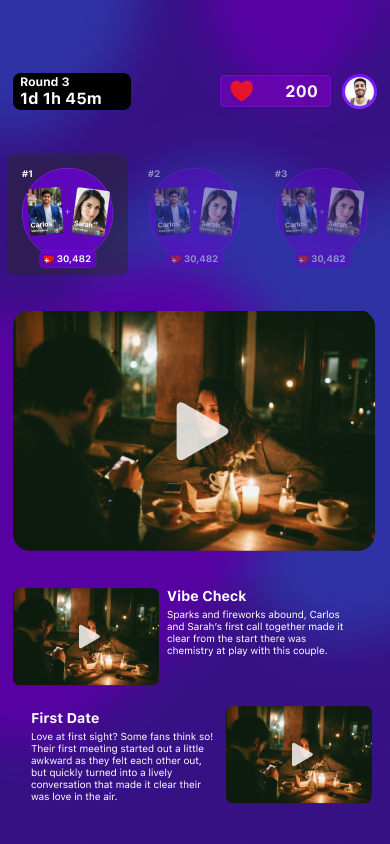

# Peer Pressure

Peer Pressure is a dating game show-as-an-app, inspired by American dating shows and HQ Trivia. In this game, participants swipe on behalf of other people ("contestants") based on whether they believe they would be a good match. They are allotted a certain amount of tokens to "vote" on each match, based on how confident they are in the match.

The game then goes through a series of elimination phases, until there is a final round, which was intended to be an recorded media event over a weekend, more akin to a traditional dating show. The participants' "votes" were tokens in a betting market, so the better they are at predicting which pairs make it to the next round, the more voting power they accrue (basically leveraging prediction markets to predict compatibility with a crowd. At the end, there would be a leaderboard based on total tokens accrued.

## Screenshots

<table>
  <tr>
    <td></td>
    <td></td>
    <td></td>
  </tr>
  <tr>
    <td></td>
    <td></td>
  </tr>
</table>

